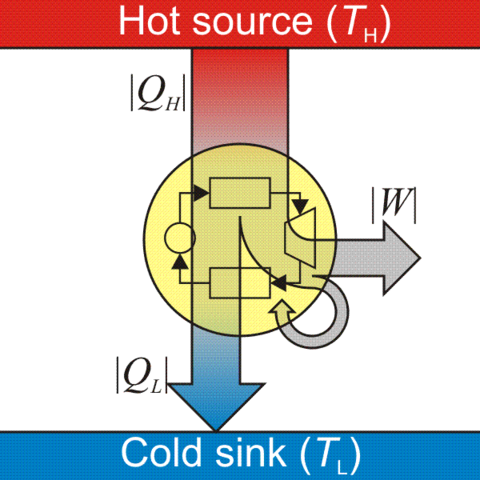

## Heat engine



A system that converts thermal energy into mechanical energy. This is achieved by reducing the temperature of the working medium. The thermal energy of the medium at high temperature in the hot reservoir $Q_H$ is converted to useful work $W$ and the rest $Q_L$ is left with the medium as it reaches a cooler temperature in the cold reservoir.

$$
+Q_H -W -Q_L = 0
$$

*Note: By convention, all variables indicate energy supplied **to** and work done **on** the system*.

More information at [Wikipedia][1].

### Efficiency

Efficiency is the ratio of useful work done *by* the system to energy provided *to* the system. For a heat engine:

$$
\eta = \frac{-W}{Q_H}
$$

An efficiency of 0.25 (1/4) means that one unit of work is done for 4 units of supplied energy.

More information on [thermal efficiency at Wikipedia][9].

## Carnot's theorem

The theorem puts the theoretical maximum limit on the efficiency of a *heat engine*. The greater the temperature difference between the hot $T_H$ and cold $T_L$ reservoirs, the higher the achievable efficiency. The maximum achievable efficiency is in a Carnot engine:

$$
\eta <= 1 - \frac{T_L}{T_H}
$$

*Note*: Temperature should be in absolute units like Kelvin.

More information on [the theorem at Wikipedia][2].

## Heat pump


A heat pump is a heat engine in reverse. Work is done *on* the system to take energy supplied by the cold reservoir *to* the system and expel it *from* the system to the hot reservoir.

$$
+Q_L +W -Q_H = 0
$$

More information at [hyperphysics][8].

## Coefficient of Performance (COP)

The COP measures the efficiency of an terms of useful energy *moved* relative to the amount of work done. For a heat pump, COP measures work required to move heat *into* the hot reservoir. For a refrigerator, COP measures work required to move heat *out of* the cold reservoir.

Because a heat pump is simply *moving* heat and not *creating* it from work, COP can - an does - exceed 1.

```
COP = Useful heat removed (or supplied) / Work done by the system
```

<div>$$
\begin{align*}
COP_{cooling} &= \frac{Q_L}{-W} \\

COP_{heating) &= \frac{-Q_H}{-W}    \\
\end{align*}
$$</div>

The theoretical maximum COP is for a Carnot cycle:

<div>$$
\begin{align*}
COP_{max cooling} &= \frac{T_L}{T_H - T_L}

COP_{mac heating) &= \frac{T_H}{T_H - T_L}
\end{align*}
$$</div>

*Note*: Temperature should be in absolute units like Kelvin.

A $COP=4$ for cooling means that a heat pump cools the cold reservoir by 4 units of heat energy using 1 unit of work to do so.

## Wet-bulb temperature

Temperature of a a thermometer wrapped in damp cloth over which air has passed and evaporative cooling has occcurred. With 100% humidity, no evaporation and hence no cooling occurs - therefore the wet bulb temperature is the same as dry-bulb/air temperature.

It is the lowest temperature that can be reached by evaporative cooling only under ambient conditions. Wet-bulb temperature is always less than or equal to ambient temperature.

Formulae for calculating wet-bulb temperature from ambient temperature and pressure can be found [here][7]. More information at [Wikipedia][3].

## Partial pressure

It is the theoretical pressure of a gas if *only* it were occupying a container. The pressure of gas in a container is the sum of partial pressures of all constituent gases. 

More information at [Wikipedia][4].

## Equilibrium vapor pressure

The pressure of vapor that is in thermodynamic equilibrium with its liquid state i.e. no net evaporation.

More information at [Wikipedia][5].

## Relative humidity

The ratio of partial pressure of water vapor to the equilibrium pressure of water vapor.

$$
\text{relative humidity} = \frac{\text{partial pressure}}{\text{equilibrium pressure}}
$$

A 100% humidity (dewpoint) means that no net evaporation can occur because the air is saturated with water vapor.

For the same amount of water vapor, at higher temperatures the relative humidity decreases as the equilibrium pressure increases.

More information at [Wikipedia][6].

[1]: https://en.wikipedia.org/wiki/Heat_engine
[2]: https://en.wikipedia.org/wiki/Carnot's_theorem_(thermodynamics)
[3]: https://en.wikipedia.org/wiki/Wet-bulb_temperature
[4]: https://en.wikipedia.org/wiki/Partial_pressure
[5]: https://en.wikipedia.org/wiki/Vapor_pressure
[6]: https://en.wikipedia.org/wiki/Relative_humidity
[7]: https://www.weather.gov/epz/wxcalc_rh
[8]: http://hyperphysics.phy-astr.gsu.edu/hbase/thermo/heatpump.html
[9]: https://en.wikipedia.org/wiki/Thermal_efficiency
