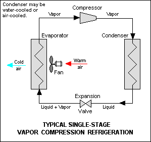

# Chiller

A chiller is a device that removes heat from a liquid. Removal of heat is done using a refrigerant - a medium that can absorb the heat energy of the liquid and dissipate it elsewhere. The refrigerant is a liquid with a low boiling point. There are two approaches for transferring heat from the target liquid:

## Vapor Compression

1. **Evaporation**: The refrigerant absorbs energy from the liquid and evaporates into saturated vapor i.e. just enough heat energy to be in gaseous state.

2. **Compression**: This is fed into a compressor which compresses the vapor and also increases its temperature - making superheated vapor. The compressor is the driver of the refrigerant medium through the cooling system.

3. **Condensation**: The high-pressure vapor passes through a condenser where it dissipates energy through coils to air or water. Under [constant pressure, as heat is removed][1], the vapor reaches saturation temperature (phase change temperature) and condenses into liquid form. A condenser can be:

    a. *Air cooled*: Air is circulated through condenser coils.

    b. *Water cooled*: Water is circulated through condenser coils. The warm water is then sent to *cooling towers* to expel heat.

    c. *Evaporatively cooled*: A mist of water is sprayed on condenser coils to absorb heat and evaporate.

4. **Expansion**: The liquid is throttled through an expansion valve. The sudden decrease in pressure [without exchanging heat with the surroundings][2] causes flash evaporation and decreases the liquid/vapor mixture's temperature.

More details:

* [Wikipedia][3]

## Absorption

An absorption chiller is based on the same principle of using a refrigerant to take away heat from the target liquid. It shares the evaporation, condensation, and expansion stages. The difference is in stage 2: the transmission of vapor between the stages. In vapor compression, the refrigerant vapor is mechanically compressed and pumped to the condenser. In absorption chiller, the gaseous vapor is absorbed/dissolved into another liquid - the absorbant (the absorption stage). It acts as the transport medium. The absorbant/refrigerant solution is then heated in another stage, causing the refrigerant to evaporate (the generator stage) and then reach the condenser as high pressure vapor. The remaining absorbant cycles back transport more vapor. The absorption cycle goes like:

1. Evaporation
2. Absorption
3. Generation
4. Condensation
5. Expansion

More details:

* [Simple Vapor Absorption Refrigeration System][5]

---

More information on chiller systems:

* [Chilled Water Central Air Conditioning Systems][4]

[1]: https://en.wikipedia.org/wiki/Boiling_point#Saturation_temperature_and_pressure
[2]: https://en.wikipedia.org/wiki/Isenthalpic
[3]: https://en.wikipedia.org/wiki/Vapor-compression_refrigeration
[4]: https://www.brighthubengineering.com/hvac/50160-chilled-water-central-air-conditioning-systems/#imgn_1
[5]: https://www.brighthubengineering.com/hvac/65923-simple-vapor-absorption-refrigeration-system/#imgn_0
