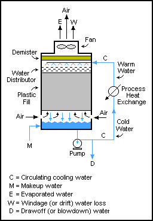

Cooling towers are used to expel heat from warm water coming out of water-cooled condensers in chiller units. The water has absorbed heat from the chiller's refrigerant as it condenses. There are three ways to transfer heat out of water:

1. **Dry cooling**: Heat transfer between water and ambient air through a surface for e.g. coils. Closed loop - no water lost. Conduction.

2. **Wet cooling**: Evaporative cooling. Temperature may go below ambient temperature down to wet-bulb temperature. Open process e.g. pans/pools - water is lost through evaporation.

3. **Fluid cooling**: Combination of dry and wet cooling. Water is sprayed on a closed loop (e.g coils) containing warm water. Evaporative cooling through the surface. Temperature may go below ambient temperature down to wet-bulb temperature.

In all cases air circulation can be induced using fans or hyperboloid cooling towers (as in power plants) to speed up cooling.

More info:

* [Cooling tower][1]

[1]: https://en.wikipedia.org/wiki/Cooling_tower
