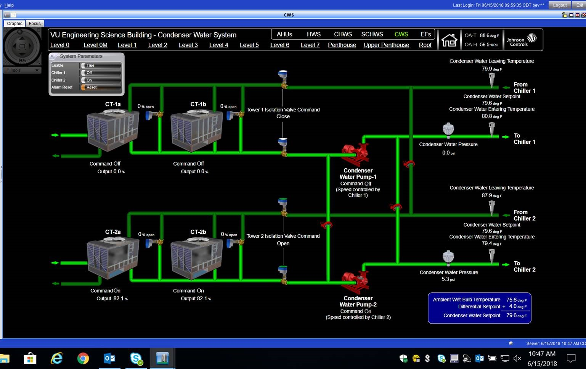

# Dataset

The dataset provided is comprised of 3 timeseries:

1. Parameters for cooling tower 1

2. Parameters for cooling tower 2

3. Fan speeds for both cooling towers

## Schematics

For the chillers:

For cooling towers:

## Cooling tower parameters

Each cooling tower has the following parameters:

1. `Time`: Timestamp in 5 minute increments.

2. `Starter Input Power Consumption (kW)`: 

3. `Cond Entering Water Temp`: Temperature of water entering the condenser unit to take away heat from the refrigerant liquid in the chiller loop.

4. `Cond Leaving Water Temp`: Temperature of water leaving the condenser after it has absorbed heat from the refrigerant liquid in the chiller loop.

5. `Tower 1a Fan Output.Trend - Present Value ()`: 

6. `Tower 1b Fan Output.Trend - Present Value ()`: 

7. `Evaporator Entering Water Temperature`: Temperature of warm water entering the evaporator to be cooled by the refrigerant liquid.

8. `Evaporator Leaving Water Temperature`: Temperature of cooler water leaving the evaporator after being cooled by the refrigerant liquid.

9. `Output Power (Watts)`:

10. `Output Power (Watts)`:

11. `Output Power (kW)`:

12. `Output Power (kW)`:

13. `Flexim M-3 (WCM-1) volumetric flow rate`: Flow rate of water through the evaporator.

14. `Outside Air Temperature`: Ambient temperature.

15. `Outside Air Humidity`: Relative ambient humidity.

16. `Ambient Wet-Bulb`: Wet-bulb temperature.

17. `Chiller 1 Percent Load (%)`: 

18. `Tons`: Amount of cooling done. Calculated using evaporator temperature change and volume flow rates (`7`, `8`, and `13`).

19. `kW/Ton`: Measure of efficiency. Lower the better. Calculated from `2` and `18`.

## Fan speed parameters

The fan speed time series simply selects the following columns from the two towers into a separate time series:

1. `Time`

2. `Tower 1a Fan Output.Trend - Present Value ()`

3. `Tower 1b Fan Output.Trend - Present Value ()`

4. `Tower 2a Fan Output.Trend - Present Value ()`

5. `Tower 2b Fan Output.Trend - Present Value ()`
