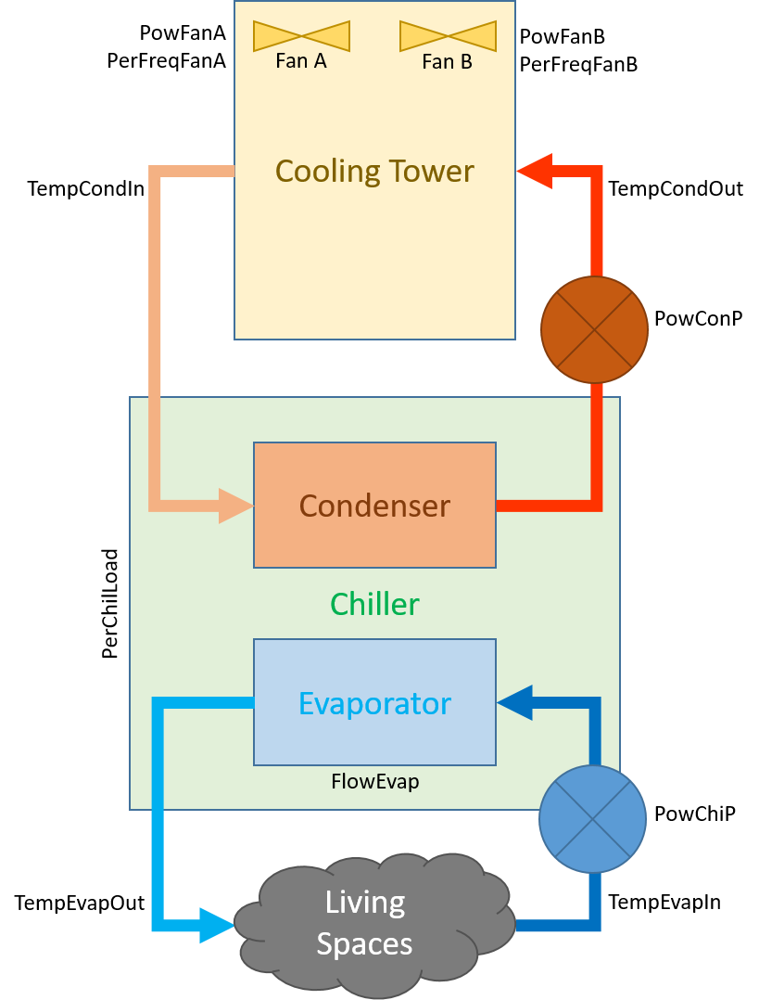

The dataset provided is comprised of 2 timeseries:

1. Parameters for Chiller 1

2. Parameters for Chiller 2

*Note: All fields are converted to SI units (Kelvins, watts, $m^3 s^{-1}$). Except for `KWPerTon`.*

## Schematics

For the chillers:

For cooling towers:

## Cooling tower parameters

Each cooling tower has the following parameters:

1. `Time`: Timestamp in 5 minute increments.

2. `PowChi`: The power consumed by the chiller (*excluding water pumps and fans*).

3. `TempCondIn`: Temperature of water entering the condenser unit to take away heat from the refrigerant liquid in the chiller loop.

4. `TempCondOut`: Temperature of water leaving the condenser after it has absorbed heat from the refrigerant liquid in the chiller loop.

5. `PerFreqFanA`: Fan A's current speed as a percentage of maximum frequency.

6. `PerFreqFanB`: Fan B's current speed as a percentage of maximum frequency.

7. `TempEvapIn`: Temperature of warm water entering the evaporator to be cooled by the refrigerant liquid.

8. `TempEvapOut`: Temperature of cooler water leaving the evaporator after being cooled by the refrigerant liquid.

9. `PowChiP`: Electrical power consumption of the chilled water pump which pumps water through the evaporator unit to be cooled on the Engineering Science Building end.

10. `PowConP`: Electrical power consumption of the condenser water pump which pumps water through the condenser unit on the chiller/cooling tower end.

11. `PowFanA`: Electrical power consumption of cooling tower fan A.

12. `PowFanB`: Electrical power consumption of cooling tower fan B.

13. `FlowEvap`: Flow rate of water through the evaporator. Units of $m^3 s^{-1}$.

14. `TempAmbient`: Ambient temperature.

15. `PerHumidity`: Relative ambient humidity.

16. `TempWetbulb`: Wet-bulb temperature.

17. `PerChilLoad`: Cooling load of the chiller as a fraction of maximum electrical capacity. The maximum cooling capacity in tons is 800 tons. The ratio `Tons / 800` should give roughly the same value as `PerChilLoad`.

And the following derived parameters:

1. `Tons`: Amount of cooling done. Calculated using evaporator temperature change and volume flow rates (`7`, `8`, and `13`).

2. `KWPerTon`: Measure of efficiency. Lower the better. Calculated from `2` and `18`.

3. `PowIn`: Total input power calculated as a sum of all power fields.
