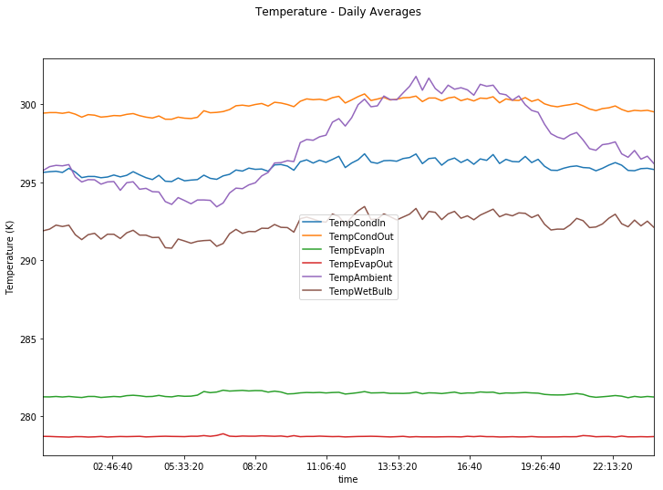
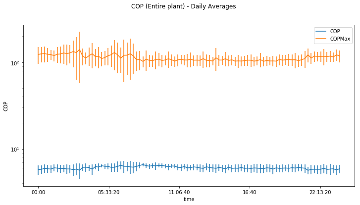
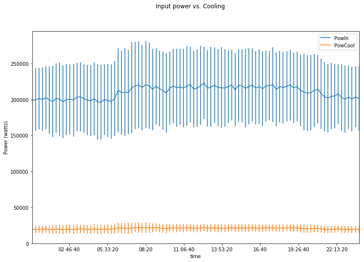
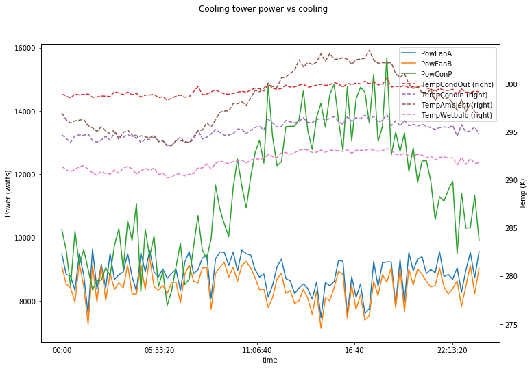
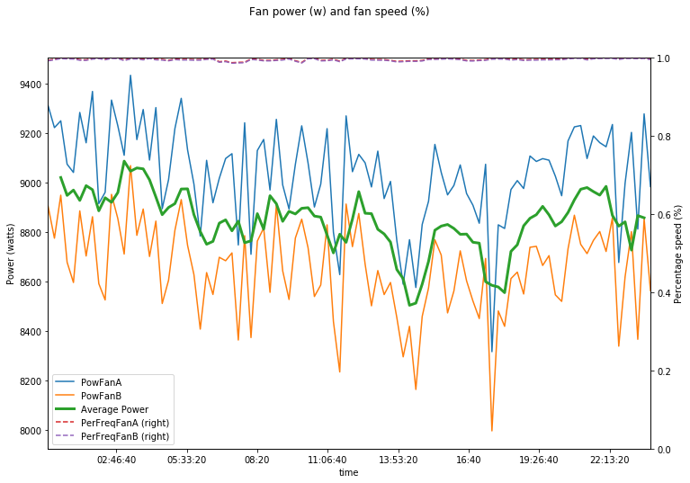

An aggregate analysis of measurements over days reveals trends in sensor readings. The following trends were obtained by averaging measurements for a time across all days in the dataset.

## Temperature

The plot shows ambient, wet-bulb, and chiller temperatures at various points. The water loops for the chiller and condenser show a consistent temperature drop throughout the day. However, the drops in the condenser loop show more variation.

## Coefficient of Performance

The theoretical maximum COP, `COPMax` and the achieved COP by the entire chiller system, `COP` are plotted. There's a consistent gap between achieved and theoretical values, indicating room for improvement. However, reaching `COPMax` gets harder as the gulf narrows.

## Input power vs. cooling

The plot of `PowIn` and `Tons` of cooling (both in watts) shows how more power is needed earlier in the day. The amount of cooling remains more or less consistent during daylight hours.

## Condenser/cooling tower cycle power

The plot shows that the controller maintains a consistent level of cooling for the condenser water loop (`TempCondOut - TempCondIn`). To achieve that, the two fans in the cooling tower vary their power consumption to ensure sufficient evaporative cooling via circulating air. The condenser water pump varies the throughput of the cooling tower.

During cooler parts of the day when the gap between ambient and wet-bulb temperatures is low (i.e. less evaporative cooling capacity), the fans operate at higher power to circulate more air. The water pump operates at lower power to give warm water time to cool in the tower.

During warmer parts of the day, the gap between ambient and wet-bulb temperatures rises (i.e. more evaporative cooling capacity). The condenser water pump increases throughput to cool more water by the same amount.

## Cooling tower fan power and fan speed

A plot of the control variable (fan speed) and the resulting power consumption shows that while power consumption generally tracks fan speed, additional variables also come into play. A moving average over a 1 hour window of mean fan A and B consumptions is shown for illustration.

This also shows that both fans in a cooling tower are identically controlled.