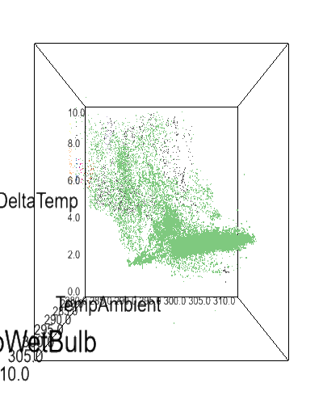

The cooling tower dissipates heat from water from the condenser in the chiller unit. The following fields in the dataset measure operation of the cooling tower:

* `TempCondIn`
* `TempCondOut`
* `PerFreqFanA`
* `PerFreqFanB`
* `PowConP`
* `PowFanA`
* `PowFanB`

With the follwing environmental varibles:

* `TempAmbient`
* `TempWetbulb`
* `PerHumidity`

**Note**: The dataset mostly has `PerFreqFan[A | B]` neat 100% which makes it difficult to account for variations in fan speed (the control variable).

```
-----------\    (TempCondOut, T_H, Warm water)       ~*~
            =====> Cond Leaving Water Temp =====>|  (Fan)   |
            |                                    |          |
Condenser   |                                    |  Cooling |
            |                                    |  Tower   |
            <===== Cond Entering Water Temp <====|          |
-----------/     (TempCondIn, T_L, Cold water)   \__________/
```

## Coefficient of performance

The theoretical maximum [Coefficient of Performance (COP)][1] is then:

$$
COP_{max} = \frac{T_L}{T_H - T_L}
$$

The achieved COP is the ratio of the energy extracted from the water to the electrical input to the cooling tower.

$$
COP = \frac{c_m m (T_H - T_L)}{E_{electrical}}
$$

Where:

* $c_m$ is the specific mass heat capacity of water i.e. energy required to heat $1g$ of water by $1 K$.
* $m$ is the mass of water being cooled.
* $T_H, T_L$ are high and low temperatures of water `TCondOut` and `TCondIn` respectively.
* $\text{Tons, PowConP, PowFanA, PowFanB}$ are all in watts.

Instead of mass and energy, mass flow rate and power can be used.

Instead of mass and energy, volumetric flow rate, power, and specific *volumetric* heat capacity can be used.

## Modelling fan speed and power consumption

*Hypothesis*: Fan power, `PowFan[A | B]` depends on ambient temperature `TempAmbient`, relative humidity `PerHumidity`, and fan speed setting `PerFreqFan[A | B]`.

### Linear regression model

A pipeline was set up where first the three features were normalized to [0-1] range. Then they were trained on a 90-10 training testing split. The coefficient of determination, $R^2 = 0.04$ indicating that the model simply predicts the mean power consumption. There is no strong linear relationship between the features and power consumption. *However*, this model is not conclusive as the data contain measurements mostly for when fan speed is near 100%. The model, as it is, simply shows that it cannot capture the noise in measurements - which is to be expected.


## Clustering

The features are clustered to extract if there are any separate modes of operation.

### Temperature

Cooling tower measurements are clustered using [DBSCAN][2] on `TempAmbient`, `TempWetbulb`, and `DeltaTemp = TempCondOut - TempCondIn`. The following animation shows clustering results:



All three temperature measurements occupy a planar space. Deviation from the plane can be used as a basis for identifying anomalous operation.

### Power

Cooling tower measurements are clustered using [DBSCAN][2] on `PowConP`, `PowFanA`, and `PowFanB`. The following animation shows clustering results:


On default options, no clusters are found. However, most of the power states are distributed along high power consumption for the two fans. The condenser water pump shows an even distribution across measurements. In this case, the concentration around high fan power makes sense as the source data mostly had fan power set to 100% of maximum frequency.

## Evaporative cooling model

The rate of evaporative cooling (watts) depends on:

* *Liquid temperature* $T(t)$ - more evaporation at *higher* water temperatures.
* *Ambient temperature* $T_a (K)$ -`TempAmbient`- more evaporation at *higher* temperatures.
* *Wet-bulb temperature* $T_w (K)$ -`TempWetbulb`- more evaporation at *lower* temperatures.
* *Air speed* $v_{air} (m/s)$- more evaporation at *higher* air speed.
* *Sunlight* $R (W/m^2)$- more evaporation at *higher* incident solar radiation.

The total cooling depends on:

* *Total time for evaporation* $t_{evap}$ - More evaporation the longer water remains in the cooling tower.

A first-order approximation would be:

$$
\frac{d}{dt} E_{evap}(T) \propto \frac{T(t) T_a v_{air} R}{T_w}
$$

Where:

$$
\begin{align*}
E_{evap}(T)                 &= c_m m (T(0) - T(t)) \\
\frac{d}{dt} E_{evap}(T)    &= -c_m m \frac{d}{dt} T(t)
\end{align*}
$$

Combining, and adding constant of proportionality $k$:

$$
\begin{align*}
-c_m m \frac{d}{dt} T           &= k \frac{T(t) T_a v_{air} R}{T_w} \\
\frac{1}{T(t)} \frac{d}{dt} T   &= -\frac{k T_a v_{air} R}{T_w c_m m} \\
T(t) &= T(0) e^{-\frac{k T_a v_{air} R}{T_w c_m m} t}
\end{align*}
$$

$v_{air}$ is unknown but can be approximated as $k_1 (\texttt{PerFreqFanA + PerFreqFanB}$).

$R$ can be calculated from time of day and location - however it is assumed constant if evaporation is in shade.

$m$ is held constant for a "parcel" of liquid being considered.

$T(t_{evap}) = \texttt{TempCondIn}$ and $T(0) = \texttt{TempCondOut}$ from the dataset.

[1]: 0-thermo-basics.md
[2]: http://scikit-learn.org/stable/modules/clustering.html#dbscan