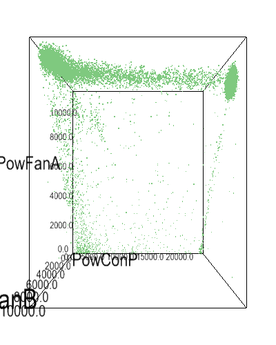

## Correlations

### Cross-correlation

The [Pearson product-moment correlation][2] was calculated for each pair of variables:

### Mutual-information

Normalized [mutual information][3] was calculated for each pair of variables. A value of 0 indicated no relationship. A value of 1 indicated perfect predictive ability between the two variables.

## Causality

### Granger causality test

TODO

## Clustering

The features are clustered to extract if there are any separate modes of operation.

### Temperature

Cooling tower measurements are clustered using [DBSCAN][1] on `TempAmbient`, `TempWetbulb`, and `DeltaTemp = TempCondOut - TempCondIn`. The following animation shows clustering results:

All three temperature measurements occupy a planar space. Deviation from the plane can be used as a basis for identifying anomalous operation.

### Power

Cooling tower measurements are clustered using [DBSCAN][1] on `PowConP`, `PowFanA`, and `PowFanB`. The following animation shows clustering results:

On default options, no clusters are found. However, most of the power states are distributed along high power consumption for the two fans. The condenser water pump shows an even distribution across measurements. In this case, the concentration around high fan power makes sense as the source data mostly had fan power set to 100% of maximum frequency.

[1]: http://scikit-learn.org/stable/modules/clustering.html#dbscan
[2]: https://en.wikipedia.org/wiki/Pearson_correlation_coefficient?oldformat=true
[3]: https://en.wikipedia.org/wiki/Mutual_information