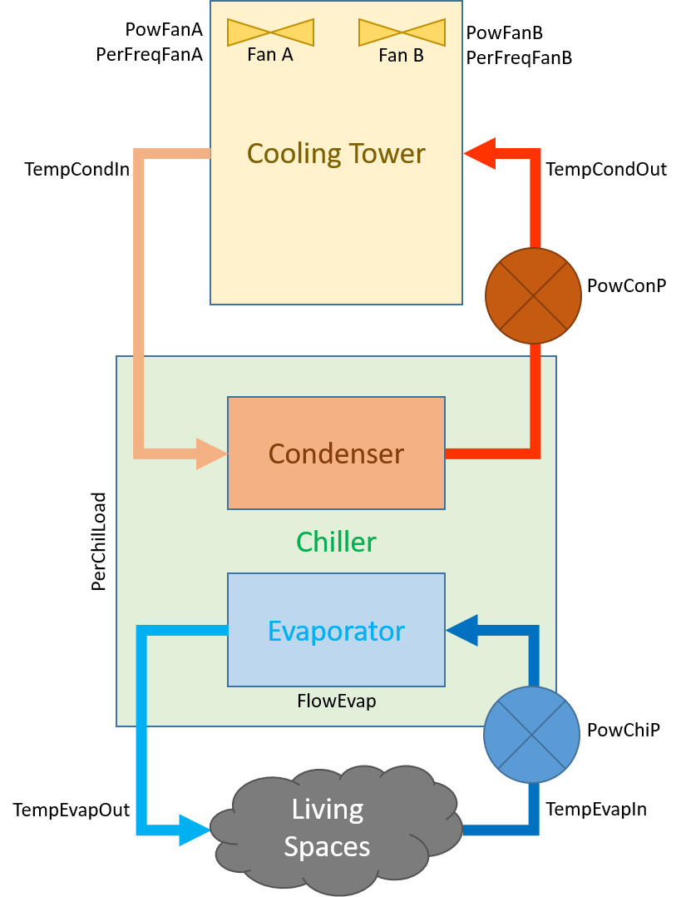
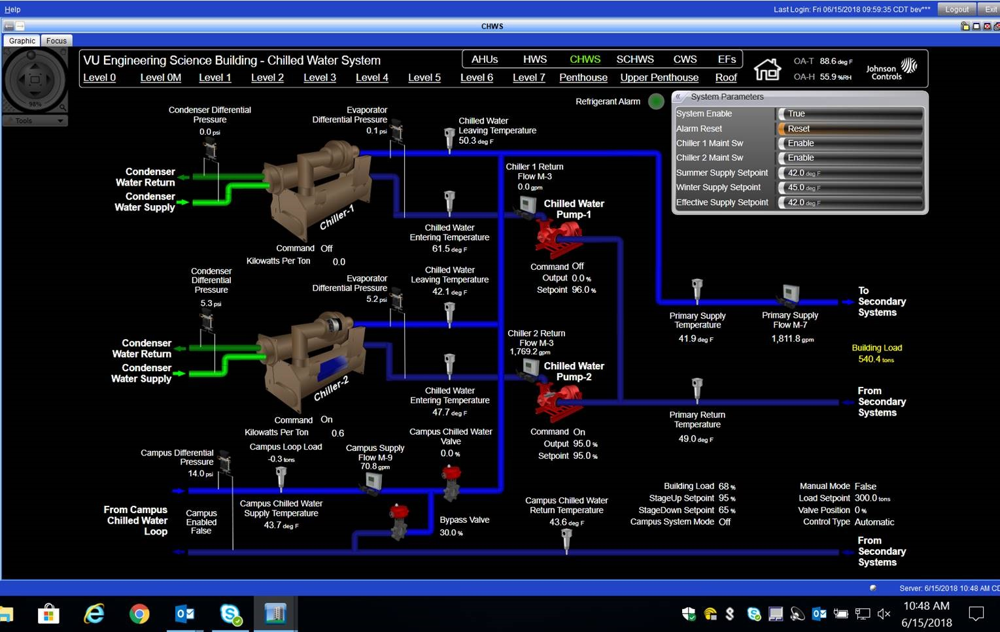

This is the data set for *Chiller 1* at the Engineering Science Building. Parameter readings were recorded from January 1, 2018 through December 31, 2018. Measurements were recorded at a 5 minute interval.

## Data extraction

The data are made available through the MetaSys application. The application is responsible for aggregating sensor readings in Engineering Science Building. It allows upto 14 days' of data and 10 fields to be viewed and copy-pasted to a spreadsheet at once.

Relevant fields are consolidated from various components (Cooling Towers, Chiller) into a survey. The survey is accessible in the navigation tree through the path:

```
Vanderbilt University
    METASYSPROD
        ESB Chiller 1
```


Multiple columns may share names (for e.g each power measurement for the 4 fans in the 2 cooling towers is labelled `Output Power.Trend - Present Value`). Therefore the order of selection of columns is vital.


The data are copied to an excel document. Since the number of fields is greater than 10, two sheets are made (with suffixes _1 and _2) for the first 10 and remaining fields. The document is then fed to a pipeline to run basic pre-processing and clean-up tasks.

## Pre-processing

### Renaming fields

The fields were manually renamed to be consistent, illustrative, and unique.

| Original Name                                                    	| Renamed     	|
|------------------------------------------------------------------	|-------------	|
| Starter Input Power Consumption.Trend - Present Value ()         	| PowChi      	|
| Cond Entering Water Temp.Trend - Present Value ()                	| TempCondIn  	|
| Cond Leaving Water Temp.Trend - Present Value ()                 	| TempCondOut 	|
| Evaporator Entering Water Temperature.Trend - Present Value ()   	| TempEvapIn  	|
| Evaporator Leaving Water Temperature.Trend - Present Value ()    	| TempEvapOut 	|
| Output Power.Trend - Present Value ()                            	| PowChiP     	|
| Output Power.Trend - Present Value ()                            	| PowConP     	|
| Output Power.Trend - Present Value ()                            	| PowFanA     	|
| Output Power.Trend - Present Value ()                            	| PowFanB     	|
| Flexim M-3 (WCM-1) volumetric flow rate.Trend - Present Value () 	| FlowEvap    	|
| Outside Air Temperature.Trend - Present Value                    	| TempAmbient 	|
| Outside Air Humidity.Trend - Present Value ()                    	| PerHumidity 	|
| Ambient Wet-Bulb.Trend - Present Value ()                        	| TempWetBulb 	|
| Chiller 1 Percent Load.Trend - Present Value ()                  	| PerChiLoad  	|
| Output Frequency.Trend - Present Value ()                        	| FreqFanA    	|
| Output Frequency.Trend - Present Value ()                        	| FreqFanB    	|
| Tower 1a Fan Output.Trend - Present Value ()                     	| PerFreqFanA 	|
| Tower 1b Fan Output.Trend - Present Value ()                     	| PerFreqFanB 	|

### Joining sheets

The data were manually copied to MS Excel in two sheets. Each row in each sheet is timestamped. Using those timestamps, all measurements for a particular time can be consolidated into a single row. This timestamp-matching necessitated by some timestamps missing from the second sheet.

### Data type

Ideally, all cells in the dataset are numerical. Some preprocessing is required to remove errant `???` symbols and text.

The raw data contain dates with timezones. Preprocessing removes timezone information.

Missing values are represented by empty cells in Excel. They are explicitly converted to `nan` in csv format.

Divisions by zero in formulas for `kw/Ton` are also explicitly converted to `nan` in csv format.

These operations are done in `ioops.py` when excel files are converted to csv.

### Units

Temperature values are recorded in degrees Farenheit. They are converted to Kelvin. Formulae in `thermo.py` rely on Kelvin values.

Power measurements in kilowatts and tons are converted to watts.

Flow rates are converted from gallons per hour to cubic metres per second.

Fields with explicit units (`kWperTon`) are not converted.

### Field names

Fields are manually renamed to remove spaces, punctuation characters, and application specific designations.

Sensor fields are first prefixed by type of measurement:

* Temperature: `Temp`
* Power: `Pow`
* Frequency: `Freq`
* Flow rate: `Flow`
* Percentage: `Per`

Sensor fields are then indexed by location of measurement:

* Condenser: `Cond`
* Evaporator: `Evap`
* Fan: `Fan`
* Chiller: `Chil`
* Chilled Water Pump: `ChiP`
* Condenser Water Pump: `ConP`

So the field measuring entering water temperature for a condenser will be `TempCondIn`.

### Missing temperature values

The towers timeseries occasionally have missing values for `Outside Air Temperature`, `Outside Air Humidity`, and `Ambient Wet-Bulb` temperature. However, given two values, the third can be calculated.

The following empirical and physical relationships are used:

1. [Arden Buck equation][1] relates saturation vapor pressure to temperature of moist air.

2. [Magnus formula][2], enhanced with Arden Buck fitting constants, relates dew point temperature to ambient temperature and relative humidity.

3. [Wet bulb temperature equation][3] by Roland Stull that relates ambient temperature and relative humidity. This relation and its inverse are used to calculate ambient or wet bulb temperatures when one is absent.

These operations are defined in `thermo.py` and called in `preprocess.py` to clean up csv files.

### Missing/zero power values

~~In several measurements power is recorded as 0. However this may not reflect the actual state of the system and may simply be an error in logging/networking or a temporary fluctuation. Because the cause of a zero measurement is indeterminate, such records are not considered during analysis.~~

Using the flag `--keep_zeros` for `preprocess.py` will keep rows where power values are 0.

In essence, the system is analyzed only at the states when all components (chiller, water pumps, fans) are operational.



*Note: All fields are converted to SI units (Kelvins, watts, $m^3 s^{-1}$).*


## Schematics

For the chillers:



For cooling towers:


## System parameters

Each cooling tower/chiller system has the following parameters:

1. `Time`: Timestamp in 5 minute increments.

2. `PowChi`: The power consumed by the chiller (*excluding water pumps and fans*).

3. `TempCondIn`: Temperature of water entering the condenser unit to take away heat from the refrigerant liquid in the chiller loop.

4. `TempCondOut`: Temperature of water leaving the condenser after it has absorbed heat from the refrigerant liquid in the chiller loop.

5. `PerFreqFanA`: Fan A's current speed as a percentage of maximum frequency.

6. `PerFreqFanB`: Fan B's current speed as a percentage of maximum frequency.

7. `TempEvapIn`: Temperature of warm water entering the evaporator to be cooled by the refrigerant liquid.

8. `TempEvapOut`: Temperature of cooler water leaving the evaporator after being cooled by the refrigerant liquid.

9. `PowChiP`: Electrical power consumption of the chilled water pump which pumps water through the evaporator unit to be cooled on the Engineering Science Building end.

10. `PowConP`: Electrical power consumption of the condenser water pump which pumps water through the condenser unit on the chiller/cooling tower end.

11. `PowFanA`: Electrical power consumption of cooling tower fan A.

12. `PowFanB`: Electrical power consumption of cooling tower fan B.

13. `FlowEvap`: Flow rate of water through the evaporator. Units of $m^3 s^{-1}$.

14. `TempAmbient`: Ambient temperature.

15. `PerHumidity`: Relative ambient humidity.

16. `TempWetBulb`: Wet-bulb temperature.

17. `PerChiLoad`: Cooling load of the chiller as a fraction of maximum electrical capacity. The maximum cooling capacity in tons is 800 tons. The ratio `Tons / 800` should give roughly the same value as `PerChilLoad`.

18. `FreqFanA`: Spinning rate of fan A in Hertz.

19. `FreqFanB`: Spinning rate of fan B in Hertz.

And the following derived fields:

1. `PowIn`: Total input power calculated as a sum of all power fields.

2. `PowCool`: Rate of heat energy extracted by the evaporator from water coming from living spaces.


[1]: https://en.wikipedia.org/wiki/Arden_Buck_equation
[2]: https://en.wikipedia.org/wiki/Dew_point#Calculating_the_dew_point
[3]: https://journals.ametsoc.org/doi/pdf/10.1175/JAMC-D-11-0143.1
